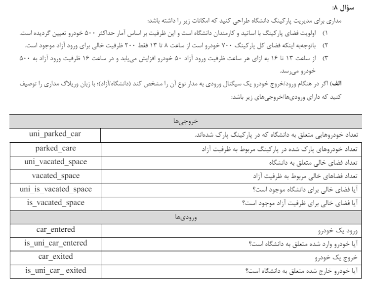

# DSD-parking-project

## Contents
- [Question Description](#question-description)
- [Part one](#part-one)
- [Test](#test)
- [Part two](#part-two)


## Question 8: University Parking Controller

**Student Number:** 401106363

**Name:** Mitra Gholipoor

The complete report in Persian :[report.pdf](./report.pdf).

## Question Description:


## Part one:

### Module Inputs and Outputs
Determining the module's inputs and outputs:
```verilog
module parking_controller(
    input wire clk,  // clock signal
    input wire rst,  // reset signal
    input wire car_entered,  // car entering the parking lot
    input wire is_uni_car_entered,  // is the entering car a university car?
    input wire car_exited,  // car exiting the parking lot
    input wire is_uni_car_exited,  // is the exiting car a university car?

    output reg [8:0] uni_parked_car,  // number of university cars parked
    output reg [8:0] f_parked_car,  // number of free cars parked
    output reg [8:0] uni_vacated_space,  // vacant university spaces
    output reg [8:0] f_vacated_space,  // vacant free spaces
    output reg is_uni_vacated_space,  // is there a vacant university space?
    output reg is_vacated_space  // is there a vacant free space?
);
```

### Setting Other Required Variables:
```verilog
module parking_controller(
    input wire clk,  // clock signal
    input wire rst,  // reset signal
    input wire car_entered,  // car entering the parking lot
    input wire is_uni_car_entered,  // is the entering car a university car?
    input wire car_exited,  // car exiting the parking lot
    input wire is_uni_car_exited,  // is the exiting car a university car?

    output reg [8:0] uni_parked_car,  // number of university cars parked
    output reg [8:0] f_parked_car,  // number of free cars parked
    output reg [8:0] uni_vacated_space,  // vacant university spaces
    output reg [8:0] f_vacated_space,  // vacant free spaces
    output reg is_uni_vacated_space,  // is there a vacant university space?
    output reg is_vacated_space  // is there a vacant free space?
```

### Setting the Clock Based on Program:

This section operates as follows: initially, the program starts at 8 AM, counting input clocks. When CLOCKS_PER_HOUR - 1 clock cycles have passed, it increments the hour variable by one. Since a day consists of 24 hours, it resets hour to zero every 24 hours.
```verilog
    // increment hour based on clock cycles
    always @(posedge clk or posedge rst) begin
        if (rst) begin
            clock_counter <= 0;
            hour <= 8;  // starting hour is 8 AM
        end else begin
            if (clock_counter == CLOCKS_PER_HOUR - 1) begin
                clock_counter <= 0;
                if (hour < 23) begin
                    hour <= hour + 1;
                end else begin
                    hour <= 0;  // reset to midnight after 23:00
                end
            end else begin
                clock_counter <= clock_counter + 1;
            end
        end
    end
```
### Determining Capacity for Different Sections:
By setting free-capacity, uni-capacity is also determined based on the earlier line.
```verilog
  assign uni_capacity = TOTAL_SPACES - free_capacity; // line 27
```
```verilog
// calculate free capacity based on the current hour
    always @(hour or rst) begin
        if (rst) begin
            free_capacity <= TOTAL_FREE_SPACES_MORNING;
        end else begin
            case (hour)
                5'd8: free_capacity <= 200;
                5'd9: free_capacity <= 200;
                5'd10: free_capacity <= 200;
                5'd11: free_capacity <= 200;
                5'd12: free_capacity <= 200;
                5'd13: free_capacity <= 250;
                5'd14: free_capacity <= 300;
                5'd15: free_capacity <= 350;
                5'd16: free_capacity <= 500;
                default: free_capacity <= 500;
            endcase
        end
    end
```
### Setting Variables Based on Inputs:
When a car enters, it can park if there is still free space in its section. Similarly, when a car exits, there must be a positive number of parked cars; otherwise, the exit is meaningless.
```verilog
    // update parking counts based on car entry and exit
    always @(posedge rst or posedge car_entered or posedge car_exited) begin
        if (rst) begin
            uni_parked_car <= 0;
            f_parked_car <= 0;
        end else begin
            // car entry
            if (car_entered) begin
                if (is_uni_car_entered) begin
                    if (is_uni_vacated_space != 0) begin
                        uni_parked_car <= uni_parked_car + 1;
                    end
                end else begin
                    if (is_vacated_space != 0) begin
                        f_parked_car <= f_parked_car + 1;
                    end
                end
            end

            // car exit
            if (car_exited) begin
                if (is_uni_car_exited) begin
                    if (uni_parked_car > 0) begin
                        uni_parked_car <= uni_parked_car - 1;
                    end
                end else begin
                    if (f_parked_car > 0) begin
                        f_parked_car <= f_parked_car - 1;
                    end
                end
            end
        end
    end
```
### Setting Outputs (Updating and Maintaining Them After Each Change):
```verilog
    // calculate vacant spaces and availability
    always @* begin

        if(uni_parked_car > uni_capacity) begin
            uni_vacated_space = 0;
        end
        else if(TOTAL_SPACES - f_parked_car >=  uni_capacity) begin
            uni_vacated_space = uni_capacity - uni_parked_car;
        end
        else begin
            uni_vacated_space = TOTAL_SPACES - uni_parked_car - f_parked_car;
        end

        if(f_parked_car > free_capacity) begin
            f_vacated_space = 0;
        end
        else if(TOTAL_SPACES - uni_parked_car >=  free_capacity) begin
            f_vacated_space = free_capacity - f_parked_car;
        end
        else begin
            f_vacated_space = TOTAL_SPACES - uni_parked_car - f_parked_car;
        end

        is_uni_vacated_space = (uni_vacated_space > 0);
        is_vacated_space = (f_vacated_space > 0);
    end
endmodule
```


Here, three conditions are checked regarding the free capacity, which I'll explain. The conditions for the university capacity are similar:
```verilog
if (f_parked_car > free_capacity) begin
    f_vacated_space = 0;
end
```
This condition applies when cars parked in the free section initially matched the allocated capacity but over time, the allocated capacity decreased. Therefore, the number of parked cars exceeds the current capacity (not the previous one).

```verilog
else begin
    f_vacated_space = TOTAL_SPACES - uni_parked_car - f_parked_car;
end
```
In the previous scenario, if it happens for university cars, then some of the free section's capacity is reduced. Considering that a maximum of 700 cars can enter, this must be taken into account so that the remaining car amount can be entered.

```verilog
else if(TOTAL_SPACES - uni_parked_car >=  free_capacity) begin
    f_vacated_space = free_capacity - f_parked_car;
end
```
In normal mode, this condition is used


## Test
For testing the following scenarios have been considered:

#### Test1: Checking capacities without cars entering or exiting:

```verilog
for (i = 0; i < 24; i = i + 1) begin
  $display("At time %d, uni_parked_car = %d, f_parked_car = %d, uni_vacated_space = %d, f_vacated_space = %d",
    dut.hour, uni_parked_car, f_parked_car, uni_vacated_space, f_vacated_space);
  #1000;
end
```
#### Test2: Entry of Excessive Free Cars:

```verilog
// enter 202 free cars
for (i = 0; i < 202; i = i + 1) begin
    car_entered = 1;
    is_uni_car_entered = 0;
    #2;
    car_entered = 0;
    is_uni_car_entered = 0;
    #2;
end
$display("enter 202 free cars: \nAt time %d, uni_parked_car = %d, f_parked_car = %d, uni_vacated_space = %d, f_vacated_space = %d",
            dut.hour, uni_parked_car, f_parked_car, uni_vacated_space, f_vacated_space);
```
#### Test3: Normal Entry and Exit of University Cars:

```verilog
        // enter 200 university cars
        for (i = 0; i < 200; i = i + 1) begin
            car_entered = 1;
            is_uni_car_entered = 1;
            #5;
            car_entered = 0;
            is_uni_car_entered = 0;
            #5;
        end
        $display("enter 200 university cars: \nAt time %d, uni_parked_car = %d, f_parked_car = %d, uni_vacated_space = %d, f_vacated_space = %d",
                    dut.hour, uni_parked_car, f_parked_car, uni_vacated_space, f_vacated_space);

        // exit 100 university cars
        for (i = 0; i < 100; i = i + 1) begin
            car_exited = 1;
            is_uni_car_exited= 1;
            #5;
            car_exited = 0;
            is_uni_car_exited = 0;
            #5;
        end
        $display("exit 100 university cars: \nAt time %d, uni_parked_car = %d, f_parked_car = %d, uni_vacated_space = %d, f_vacated_space = %d",
                    dut.hour, uni_parked_car, f_parked_car, uni_vacated_space, f_vacated_space);
```

#### Test4: Entering and Exiting 50 University Cars Sequentially:

```verilog
// enter and exit 50 university cars
for (i = 0; i < 50; i = i + 1) begin

    car_exited = 1;
    is_uni_car_exited = 1;

    #1 car_exited = 0;
    is_uni_car_exited = 0;
    
    #1 car_entered = 1;
    is_uni_car_entered = 1;
    
    #1 car_entered = 0;
    is_uni_car_entered = 0;
    #1;
end
$display("enter and exit 50 university cars: \nAt time %d, uni_parked_car = %d, f_parked_car = %d, uni_vacated_space = %d, f_vacated_space = %d",
            dut.hour, uni_parked_car, f_parked_car, uni_vacated_space, f_vacated_space);
```


#### Test5: Checking Capacities Without Car Entries and Exits:

```verilog
// enter 402 university cars
for (i = 0; i < 402; i = i + 1) begin
    car_entered = 1;
    is_uni_car_entered = 1;
    #1;
    car_entered = 0;
    is_uni_car_entered = 0;
    #1;
end
$display("enter 402 university cars: \nAt time %d, uni_parked_car = %d, f_parked_car = %d, uni_vacated_space = %d, f_vacated_space = %d",
            dut.hour, uni_parked_car, f_parked_car, uni_vacated_space, f_vacated_space);
```
#### Test6: Displaying Capacity Increase with Hourly Change:

In this test case, the section took as many cars as possible, but the total capacity, which is 700, was considered. Also, university cars are parked in the parking lot, so they cannot enter.

```verilog
// exit 25 university cars
for (i = 0; i < 25; i = i + 1) begin
    car_exited = 1;
    is_uni_car_exited = 1;
    #1;
    car_exited = 0;
    is_uni_car_exited = 0;
    #1;
end
$display("exit 25 university cars: \nAt time %d, uni_parked_car = %d, f_parked_car = %d, uni_vacated_space = %d, f_vacated_space = %d",
            dut.hour, uni_parked_car, f_parked_car, uni_vacated_space, f_vacated_space);

#1000
// enter 50 free cars
for (i = 0; i < 50; i = i + 1) begin
    car_entered = 1;
    is_uni_car_entered = 0;
    #5;
    car_entered = 0;
    is_uni_car_entered = 0;
    #5;
end
$display("enter 50 free cars: \nAt time %d, uni_parked_car = %d, f_parked_car = %d, uni_vacated_space = %d, f_vacated_space = %d",
            dut.hour, uni_parked_car, f_parked_car, uni_vacated_space, f_vacated_space);
```
#### Test7: Displaying Actual Free Capacity After University Section is Cleared:

```verilog
// exit 130 university cars
for (i = 0; i < 130; i = i + 1) begin
    car_exited = 1;
    is_uni_car_exited = 1;
    #1;
    car_exited = 0;
    is_uni_car_exited = 0;
    #1;
end
$display("exit 130 university cars: \nAt time %d, uni_parked_car = %d, f_parked_car = %d, uni_vacated_space = %d, f_vacated_space = %d",
            dut.hour, uni_parked_car, f_parked_car, uni_vacated_space, f_vacated_space);
```

#### Test8: Simultaneous Entry and Exit from Free Section:

```verilog
// enter and exit 50 free cars
for (i = 0; i < 50; i = i + 1) begin
    car_exited = 1;
    is_uni_car_exited = 0;

    #1 car_exited = 0;
    is_uni_car_exited = 0;
    
    #1 car_entered = 1;
    is_uni_car_entered = 0;
    
    #1 car_entered = 0;
    is_uni_car_entered = 0;
    #1;
end
$display("enter and exit 50 free cars: \nAt time %d, uni_parked_car = %d, f_parked_car = %d, uni_vacated_space = %d, f_vacated_space = %d",
            dut.hour, uni_parked_car, f_parked_car, uni_vacated_space, f_vacated_space);
```
#### Test9: Testing Hourly Change and Entry Overflow in the New Hour:

Note that the clock_counter is 82, meaning there is an 18-clock difference until the next hour. According to the code, each car goes through two clocks, so we expect the cars to enter after 9 more clocks.

```verilog
$display("enter and exit 50 free cars: \nAt time %d, uni_parked_car = %d, f_parked_car = %d, uni_vacated_space = %d, f_vacated_space = %d",
            dut.hour, uni_parked_car, f_parked_car, uni_vacated_space, f_vacated_space);
$display("clock counter:%d",dut.clock_counter);
// enter 200 university cars
for (i = 0; i < 200; i = i + 1) begin
    car_entered = 1;
    is_uni_car_entered = 1;
    #10;
    car_entered = 0;
    is_uni_car_entered = 0;
    #10;
end
$display("enter 200 university cars: \nAt time %d, uni_parked_car = %d, f_parked_car = %d, uni_vacated_space = %d, f_vacated_space = %d",
            dut.hour, uni_parked_car, f_parked_car, uni_vacated_space, f_vacated_space);
```

#### Test10: Normal Exit of Free Cars and Unusual Exit Changing Capacity from 7 to 8:

```verilog
// exit 40 free cars
for (i = 0; i < 40; i = i + 1) begin
    car_exited = 1;
    is_uni_car_exited = 0;
    #10;
    car_exited = 0;
    is_uni_car_exited = 0;
    #10;
end
$display("exit 40 free cars: \nAt time %d, uni_parked_car = %d, f_parked_car = %d, uni_vacated_space = %d, f_vacated_space = %d",
            dut.hour, uni_parked_car, f_parked_car, uni_vacated_space, f_vacated_space);

// exit 400 university cars
for (i = 0; i < 400; i = i + 1) begin
    car_exited = 1;
    is_uni_car_exited = 1;
    #10;
    car_exited = 0;
    is_uni_car_exited = 0;
    #10;
end
$display("exit 400 university cars: \nAt time %d, uni_parked_car = %d, f_parked_car = %d, uni_vacated_space = %d, f_vacated_space = %d",
            dut.hour, uni_parked_car, f_parked_car, uni_vacated_space, f_vacated_space);

#1000
$display("At time %d, uni_parked_car = %d, f_parked_car = %d, uni_vacated_space = %d, f_vacated_space = %d",
            dut.hour, uni_parked_car, f_parked_car, uni_vacated_space, f_vacated_space);

#1000 $stop;
```
## Testing Various Scenarios

### No Entry or Exit
- Ensured no cars entered or exited to observe stable conditions.

### Capacity Change at Specific Times
- Monitored capacity adjustments at 12 and from 7 to 8.

### Normal Entry and Exit
- Tested regular flow of cars entering and exiting.

### Capacity Exceeded
- Verified system response when the capacity limit was exceeded.

### Simultaneous Operations
- Checked simultaneous entry and exit operations.

### Total Spaces and Non-Negative Values
- Ensured total spaces remained at 700 and all values were non-negative.

Each scenario was tested to validate the expected behavior of the system.

## Part two
I used Quartus software with the MAX V device for my circuit design.


The circuit output is available in the file: [export-circuit.pdf](./synthesize/export-circuit.pdf).

The frequency values in the synthesis report indicate the maximum clock frequencies at which various parts of the FPGA design can reliably operate. For car_entered, this frequency represents the highest rate at which logic related to the car_entered signal can reliably function. This implies that the data path and combinatorial logic involving the car_entered signal have a critical path with delay that limits the maximum clock frequency to this value. The constrained value, Fmax, confirms this limitation.

For clk, this value represents the highest clock frequency at which the entire design can operate. It reflects the critical path delay of the entire design driven by the main clock signal (clk). The constrained value, Fmax, aligns with this value, indicating that after placement and routing, the design can still operate at this frequency without violating timing constraints. The maximum frequency is determined by the longest delay in the critical path of the circuit. Different parts of the design have different critical paths leading to different maximum frequencies. These varying frequencies demonstrate timing constraints diversity across different sections of the FPGA design.

Due to longer critical paths, logic related to the car_entered signal restricts its operation to a lower frequency, whereas the overall design driven by the main clock (clk) can operate at a higher frequency. These insights help in identifying and optimizing critical paths to enhance design performance.

